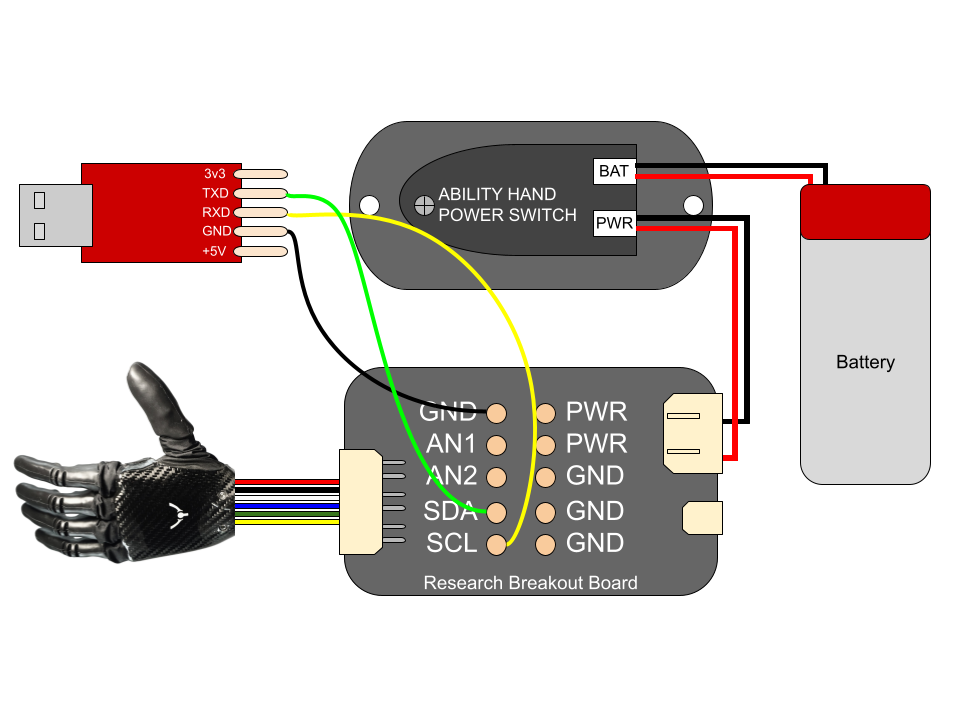

## Ability Hand API

This repository contains the [PSYONIC Ability Hand API documentation](https://github.com/psyonicinc/ability-hand-api/blob/master/Documentation/ABILITY-HAND-ICD.pdf) and examples/wrappers using the API. 

 - [Python](https://github.com/psyonicinc/ability-hand-api/tree/master/python) (Linux, Windows, MacOS)
   - Simulation ([Mujoco](https://github.com/psyonicinc/ability-hand-api/tree/master/python/ah_simulators#mujoco))
 - [C++](https://github.com/psyonicinc/ability-hand-api/tree/master/cpp) (Linux, Windows) 
 - [MATLAB](https://github.com/psyonicinc/ability-hand-api/tree/master/MATLAB) (Legacy I2C API Only)

See the README.md in individual folders for more information.  

# Quickstart Guide

### Connect Ability Hand and serial adapter

Ensure you connect the ABILITY HAND, POWER SWITCH and BREAKOUT BOARD correctly.
Windows users will first need to [install drivers](https://www.silabs.com/documents/public/software/CP210x_Windows_Drivers.zip)
for the USB serial adapter.

1. Connect PWR (POWER SWITCH) ➡️ PWR CONNECTOR (BREAKOUT BOARD) 
2. 6 PIN (ABILITY HAND) ➡️ 6 PIN (BREAKOUT BOARD)  
3. GND (SERIAL ADAPTER) ➡️ GND (BREAKOUT BOARD)
4. RXD (SERIAL ADAPTER) ➡️ SCL (BREAKOUT BOARD) 
5. TXD (SERIAL ADAPTER) ➡️ SDA (BREAKOUT BOARD)
6. SERIAL ADAPTER ➡️ COMPUTER
7. Connect Lipo Battery ➡️ BAT (POWER SWITCH)
8. Power on Ability Hand (hold power button for 1 second then release when you see the white LED)
9. You will see the LED flash red then go solid red

Linux users will need to issue the following command after plugging in USB 
serial adapter.

`sudo chmod a+rw /dev/ttyUSB*` 

To avoid having to issue the above command every time you can issue:

`sudo usermod -aG dialout $USER`

And restart your computer.

### Enable UART Using App

The hand ships in I2C mode but UART is recommended, to enable UART using the 
PSYONIC mobile app:

Scan ➡️ SELECT HAND ➡️ Gear Icon ⚙️
(Top Right) ➡️ Troubleshoot ➡️ Developer Mode

and issue the following command

We16

### Run Examples

You are now ready to run examples using [Python](https://github.com/psyonicinc/ability-hand-api/tree/master/python)
(*recommended for new users*) or [C++](https://github.com/psyonicinc/ability-hand-api/tree/master/cpp).  
See their respective README's for instructions on getting started.

### Power off Ability Hand

To power off the hand hold the power button for 1 second, the white LED will 
pulse, then go out, indicating that the power is off.

### Charging The Battery

You can charge the Lipo battery by plugging the provided USB-C charger to the 
ABILITY HAND POWER SWITCH.  You can leave everything connected, but you cannot 
operate the Ability Hand while it is charging.
