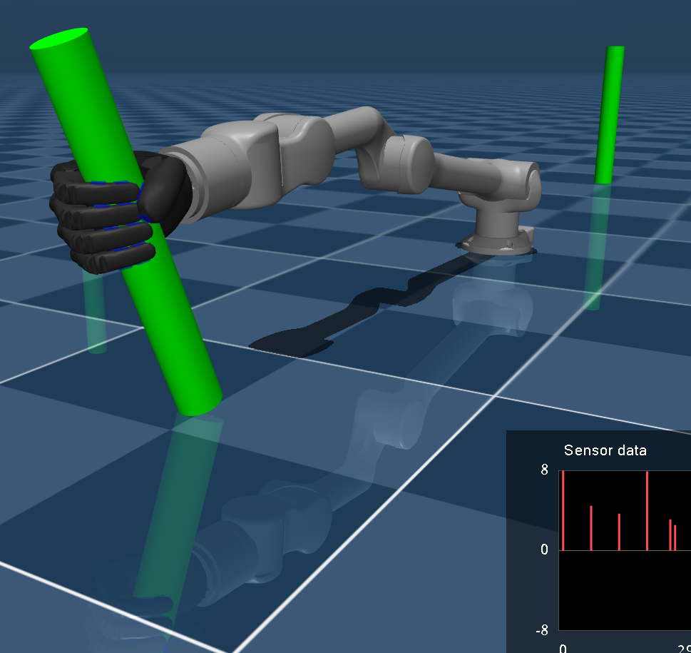

## Ability Hand - Mujoco 

<div style="text-align: center;">
    
</div>
  

The follow repository offers a mujoco XML description of all four different 
types of Ability Hands.  Collisions are detected using a simplified version of
meshes of the hand and inertia is calcuated by applying the known masses to the
simplified meshes.  The touch sensors of the Ability Hand are also simulated.  
To launch the hand alone use

```python3 mujoco_viewer.py ./scene.xml```


Examples of popular robots have been integrated from Mujoco's [menagerie](https://github.com/google-deepmind/mujoco_menagerie) 
:

- Unitree Z1 : ```python3 mujoco_viewer.py ./unitree_z1/scene.xml```
- Franka FR3 : ```python3 mujoco_viewer.py ./franka_fr3/scene.xml```
- UFACTORY xArm7 : ```python3 mujoco_viewer.py ./ufactory_xarm7/scene.xml```
- Unitree G1 : ```python3 mujoco_viewer.py ./unitree_g1/scene.xml```
- Unitree H1 : ```python3 mujoco_viewer.py ./unitree_h1/scene.xml```

The hand is a 4 bar linkage mechanism forming an 'X'. 4 bar linkages are not 
supported in the urdf/mujoco format. The motion of the finger pip joint is based on 
a approximate linear relationship to the mcp joint.  This 'mimicing' is done via
the python loop code rather than the equality property in the xml.  For Example:

```python
# Actuators
actuators = [
    "index_mcp_actuator",
    "_index_pip_actuator",
    "middle_mcp_actuator",
    "_middle_pip_actuator",
    "ring_mcp_actuator",
    "_ring_pip_actuator",
    "pinky_mcp_actuator",
    "_pinky_pip_actuator",
    "thumb_flexor_actuator",
    "thumb_rotator_actuator",
]

act_ids = [mujoco.mj_name2id(model, mujoco.mjtObj.mjOBJ_ACTUATOR, i) for i in actuators]

with mujoco.viewer.launch_passive(model, data) as viewer:
    while viewer.is_running():
        if -1 not in act_ids:
            for j in range(0, 7, 2):
                data.ctrl[act_ids[j + 1]] = (
                    data.ctrl[act_ids[j]] * 1.05851325 + 0.72349796
                )

        mujoco.mj_step(model, data)
        viewer.sync()
```