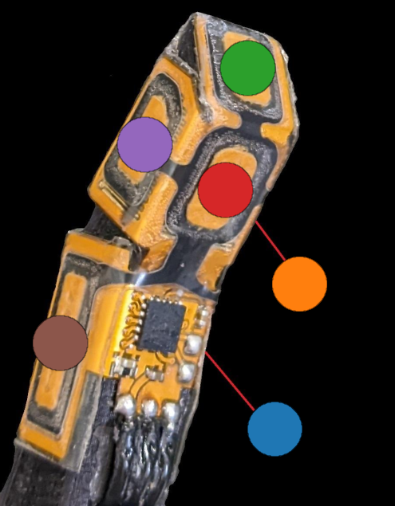

# Startup Guide

Congratulations on becoming the owner of a new PSYONIC Ability Hand.  This guide
is designed to get you up and running as quickly as possible and to familiarize
yourself with our Python  Serial Wrapper for the Ability Hand.  For optimal 
speed a Linux or Mac computer is recommended, but Windows is compatible as well.

### Connect Ability Hand and serial adapter

Ensure you connect the ABILITY HAND, POWER SWITCH and BREAKOUT BOARD correctly.
Windows users will first need to [install drivers](https://www.silabs.com/documents/public/software/CP210x_Windows_Drivers.zip)
for the USB serial adapter.


1. Connect PWR (POWER SWITCH) ➡️ PWR CONNECTOR (BREAKOUT BOARD) 
2. 6 PIN (ABILITY HAND) ➡️ 6 PIN (BREAKOUT BOARD)  
3. GND (SERIAL ADAPTER) ➡️ GND (BREAKOUT BOARD)
4. RXD (SERIAL ADAPTER) ➡️ SCL (BREAKOUT BOARD) 
5. TXD (SERIAL ADAPTER) ➡️ SDA (BREAKOUT BOARD)
6. SERIAL ADAPTER ➡️ COMPUTER
7. Connect Lipo Battery ➡️ BAT (POWER SWITCH)
8. Power on Ability Hand (hold power button for 1 second)

Linux users will need to issue the following command after plugging in USB 
serial adapter.

`sudo chmod a+rw /dev/ttyUSB*` 

You can charge the Lipo battery by plugging the provided USB-C charger to the 
ABILITY HAND POWER SWITCH.  You can leave everything connected but you cannot 
operate the Ability Hand while it is charging.

### Install Requirements
Preferably using a [virtual env](https://docs.python.org/3/library/venv.html)  from the root directory issue  
`pip install -r requirements.txt`

### Enable UART & Byte Stuffing using App

This codebase uses serial communication and requires [byte stuffing](https://www.tutorialspoint.com/data_communication_computer_network/byte_stuffing.htm) 
to be enabled.  From the PSYONIC app select 

Scan ➡️ SELECT HAND ➡️ Gear Icon ⚙️
(Top Right) ➡️ Troubleshoot ➡️ Developer Mode

and issue the following comands 
individually.

We16  
We46  
We47

## Run examples

The Ability Hand can provide position, velocity and current feedback from the 
hand.  To see this in action run the following examples (close plot window to 
quit program):

### Motor Example With Postion Velcocity and Torque Feedback

`python3 plot_motors.py`

### Touch Sensors Example

The Ability Hand also has 30 touch sensors (6 per finger) which you can see 
responding in real time by running the example

`python3 plot_touch_sensors.py`

Below is a map of each sensor and it's associated plot color.



### Motor Example Without Plots

Running examples with plotting in real time using python uses alot of 
processing power, and you may see some stutters. Run the hand wave without plots
using.

`python3 hand_wave.py`

You can press `Ctrl + c` to stop

## Run in Terminal / Integrate with Code

You can look at the [AHSerialClient](docs/AHSerialClient.md) documentation to see
available commands and arguments associated with the class but below is a break-
down and examples you can run.

---

#### Create Client

First open a python terminal in the package root directory and import the 
AHSerialClient class

```from ah_wrapper.ah_serial_client import AHSerialClient```

and create a client instance:

```client = AHSerialClient()```

This will automatically find a serial connection to the hand and start a thread
for writing and reading data from the hand.  Any time you issue a set function
(i.e. set_position, set_duty, set_command) the command that the write thread issues 
will be updated, i.e. the client will repeatedly send the most recent target / 
command. The hand must receive a command every 300ms or else it will exit its 
API control mode.  


---

#### Set and Send Position Targets

Update the command with a position target using:

```client.set_position([50,50,50,50,50,-50])```

This will set all fingers to this desired position. Note that finger indexes 
always follow the following pattern `[index, middle, ring, pinky, thumb flexor, 
thumb rotator]`. Note that the thumb rotator operates in a `[0,-100]` range and 
the rest of the fingers are in a `[0,100]` range.

---

#### Understanding Hand class


You can ensure that the feedback from the hand class is correct by issuing:

```client.hand.get_position()```

Each client has its own Hand class. You can see all the public Hand class 
commands for reading values [here](docs/Hand.md)

---

#### Set and Send Duty Targets

You can also pass a single argument to a set command, and it will apply it to each
of the fingers.  For example to set a 10% duty to all fingers, issue.  Valid 
duty range is -100 to 100.

```client.set_duty(-10)```

Notice how we any passed one argument. Any of the set commands can take either 
one argument or will take an array of six values as seen above.  If you pass a 
single value it will apply it to all fingers equally.

---

#### Set and Send Torque Targets


Try sending a small amount of torque and notice that the fingers will stop moving
if anything gets in their way.

```client.set_torque([0.1,0.1,0.1,0.1,0.1,-0.1])```

```client.set_torque(-0.1)```

You can also verify the current draw is not going over the desired set_torque 
amount.

```client.hand.get_current()```

---

#### Reply Modes

If you issue a `client.hand.get_velocity()` command you will notice it returns
nothing, this is because we have only been sending reply_mode=0 as default and
we have never received any velocity feedback.

The reply modes are as following starting with a 0 index.

0. Finger position, current, touch sensors
1. Finger position, rotor velocity, touch sensor
2. Finger position, current, rotor velocity

Simply pass the *reply_mode* argument to any set_ command.  

```client.set_position(30, reply_mode=1)```


---

#### Send Grip Commands

Lastly you can send individual grip commands from the datasheet.

```client.set_grip(0x10)```

---

#### Closing Client

Lastly finish any session using

```client.close()```

This will stop any threads sending and receiving commands to the ability hand.

---

#### Further examples

In most typical integrations
you will create your own write thread and [send messages](./ah_wrapper/ah_api.py) 
manually using AHSerialClient.send_command() see [hand_wave.py](./hand_wave.py) 
or [plot_motors.py](./plot_motors.py) for examples on how to do that.  

***Note that in this 
above example a write thread was constantly sending the current target at 500hz
and a read thread was parsing feedback responses.  See [AHSerialClient](docs/AHSerialClient.md) for more details***

You can update the target that send_command sends using any of the set_ 
commands, or you can build the message manually and pass that as an argument to the send command.
